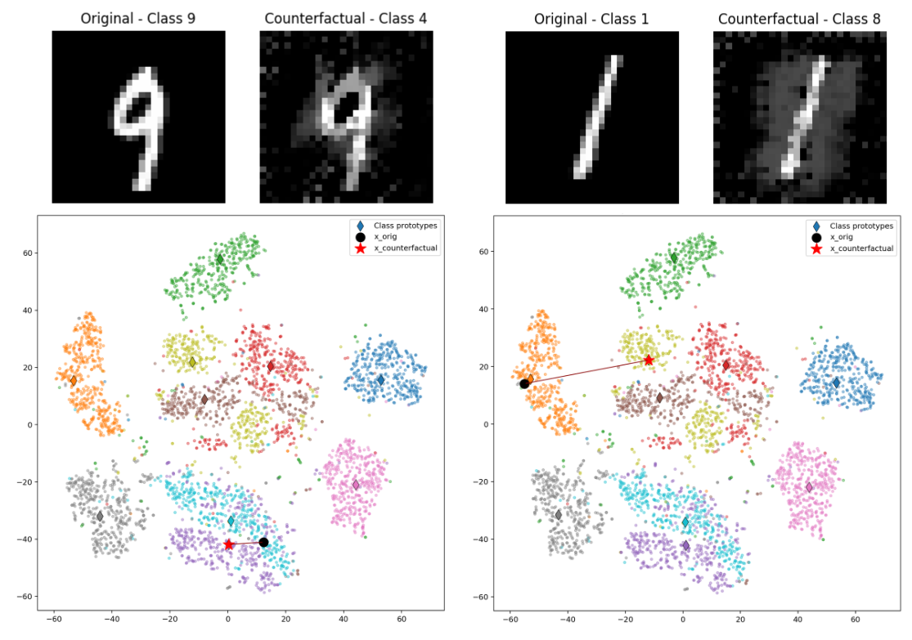

# Interpretable Counterfactual Explanations Guided by Prototypes

This repository provides a PyTorch implementation of the paper "Interpretable Counterfactual Explanations Guided by Prototypes" (Van Looveren and Klaise, 2020).

Paper: [https://arxiv.org/pdf/1907.02584](https://arxiv.org/pdf/1907.02584)

## Overview

This implementation generates interpretable counterfactual explanations for image classification models using prototype-based guidance. The method combines autoencoders with prototype learning to produce plausible and class-representative counterfactual examples.





### Generating Counterfactuals

Run the main script to generate counterfactual explanations:

```bash
python CFG_main.py
```

Configuration options in `CFG_main.py`:

- `PROTO_METHOD`: Set to `"kmeans"` for prototype-based guidance or `None` for nearest neighbor
- `K_CLUSTERS`: Number of prototypes per class (default: 3)
- `AE_CHECKPOINT_DIR`: Directory containing model checkpoints
- `AE_GLOBAL_CHECKPOINT`: Path to global autoencoder checkpoint


## Algorithm

The counterfactual generation process optimizes the following objective:

- **Prediction Loss**: Ensures the counterfactual is classified as the target class
- **L1/L2 Loss**: Minimizes the perturbation from the original input
- **Prototype Loss**: Guides the counterfactual towards class prototypes in latent space
- **Autoencoder Loss**: Maintains plausibility through reconstruction

The main objective function to optimize is:

$$\min_{\delta} \; c \cdot L_{\text{pred}} + \beta \|\delta\|_1 + \|\delta\|_2^2 + L_{AE} + L_{\text{proto}}$$

## Metrics

- **IM1**: Measures consistency with class-specific autoencoder
- **IM2**: Measures plausibility using global autoencoder reconstruction

## Results

Generated counterfactuals and visualizations are saved in the `outputs/` directory. Training logs and metrics are available in the `logs/` directory and can be viewed using TensorBoard.

## References

```bibtex
@article{van2019interpretable,
  title={Interpretable counterfactual explanations guided by prototypes},
  author={Van Looveren, Arnaud and Klaise, Janis},
  journal={arXiv preprint arXiv:1907.02584},
  year={2019}
}
```

## Author

BAIM M. Jalal
